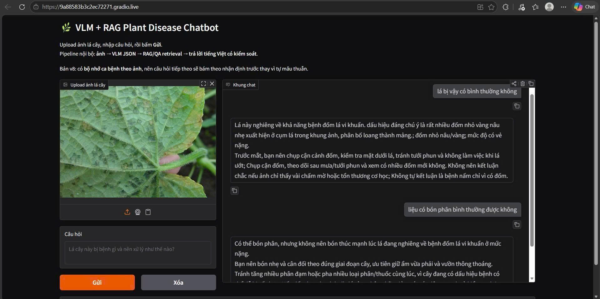

# AgriExpert Multimodal RAG

## Giới thiệu
**AgriExpert Multimodal RAG** là một hệ thống chatbot AI tiên tiến dành riêng cho lĩnh vực nông nghiệp, kết hợp sức mạnh của mô hình ngôn ngữ - thị giác lớn (Multimodal VLM) và kỹ thuật RAG (Retrieval-Augmented Generation). 
Dự án được thiết kế nhằm cung cấp thông tin, hỗ trợ giải đáp các câu hỏi chuyên sâu về cây trồng và nông nghiệp bằng cách truy xuất thông tin từ cơ sở dữ liệu kết hợp với khả năng xử lý hình ảnh và văn bản. Mô hình chính được sử dụng và tinh chỉnh trong dự án là **Qwen-VL-3B** (thông qua phương pháp LoRA).

## Tính năng chính
- **Hệ thống RAG Đa phương thức:** Tự động tìm kiếm và truy xuất thông tin từ kho dữ liệu tri thức để trả lời câu hỏi dựa trên cả ngữ cảnh văn bản lẫn hình ảnh.
- **Tinh chỉnh (Fine-tuning) Qwen-VL-3B:** Cải thiện khả năng hiểu và trả lời chuyên ngành nông nghiệp của mô hình bằng phương pháp LoRA.
- **Xử lý Dữ liệu Chuyên sâu:** Tích hợp các quy trình Data Augmentation (Tăng cường dữ liệu) và Similarity Filter (Lọc dữ liệu dựa trên độ tương đồng) để đảm bảo chất lượng dữ liệu đầu vào.
- **Giao diện Người dùng thân thiện:** Triển khai chatbot để người dùng dễ dàng tương tác thông qua giao diện web trực quan xây dựng bằng **Gradio**.
- **Đánh giá mô hình:** Tích hợp sẵn quy trình (pipeline) để đánh giá chất lượng câu trả lời của chatbot.

## Công nghệ sử dụng
- **Multimodal VLM (Qwen-VL-3B):** Mô hình nền tảng hỗ trợ xử lý và hiểu đồng thời văn bản và hình ảnh.
- **RAG (Retrieval-Augmented Generation):** Kỹ thuật truy xuất thông tin từ cơ sở dữ liệu bên ngoài để tăng cường độ chính xác và tính cập nhật cho câu trả lời của AI mà không cần phải huấn luyện lại toàn bộ mô hình.
- **LoRA (Low-Rank Adaptation):** Phương pháp tinh chỉnh mô hình (Fine-tuning) hiệu quả, tối ưu bộ nhớ và thời gian tính toán, giúp mô hình nhanh chóng học được các kiến thức chuyên ngành nông nghiệp.
- **Gradio:** Framework xây dựng giao diện người dùng (UI) trực quan và nhanh chóng cho các ứng dụng Machine Learning.
- **Hugging Face (Transformers & PEFT):** Các thư viện lõi dùng để triển khai, quản lý và huấn luyện các mô hình học sâu (Deep Learning).

## Cấu trúc Repository

Các thành phần và tệp tin chính trong dự án bao gồm:

- `gradio-vlm-rag-chatbot.ipynb`: Mã nguồn khởi chạy giao diện người dùng của chatbot (UI) với Gradio, tích hợp hệ thống RAG và VLM.
- `train-qwen-vl-3b-lora.ipynb`: Notebook thực hiện quy trình huấn luyện và tinh chỉnh (fine-tune) mô hình Qwen-VL-3B.
- `SPCQA_Augmentation.ipynb`: Quy trình xử lý và tăng cường dữ liệu huấn luyện.
- `SPCQA_Similarity_Filter.ipynb`: Quy trình lọc và loại bỏ các dữ liệu trùng lặp/tương đồng, làm sạch tập dữ liệu.
- `eval-chatbot.ipynb`: Notebook dùng để đánh giá hiệu suất và chất lượng đầu ra của chatbot.
- `all_crops_rag_knowledge_standard_core.csv`: Tập dữ liệu cốt lõi làm cơ sở tri thức (Knowledge Base) cho RAG.
- `all_crops_spcqa_v4_similarity_safe_clean_merged.csv`: Tập dữ liệu Q&A đã được làm sạch dùng cho việc fine-tune mô hình.

## Dữ liệu (Dataset)
Bộ dữ liệu gốc có thể được tải xuống tại liên kết dưới đây:
**[Tải xuống Dataset đầy đủ](https://drive.google.com/drive/folders/1hRDcPr7Rkk-vURv8nFV-6K_XdX94ae_M?usp=sharing)**

## Hướng dẫn cài đặt và sử dụng

1. **Chuẩn bị Dữ liệu:**
   - Tải bộ dữ liệu từ liên kết phía trên.
   - Đảm bảo các file `.csv` cần thiết đã được đặt vào thư mục gốc của dự án.

2. **Cài đặt Môi trường & Xử lý Dữ liệu:**
   - Cài đặt các thư viện Python cần thiết (Transformers, PEFT, Gradio, v.v. tùy theo yêu cầu trong từng notebook).
   - Nếu bạn muốn tự tạo lại dữ liệu sạch, hãy chạy tuần tự `SPCQA_Augmentation.ipynb` và `SPCQA_Similarity_Filter.ipynb`.

3. **Huấn luyện Mô hình (Tùy chọn):**
   - Chạy `train-qwen-vl-3b-lora.ipynb` nếu bạn muốn tự fine-tune lại mô hình với bộ dữ liệu của riêng mình.

4. **Khởi chạy Chatbot:**
   - Mở và chạy toàn bộ các ô code (cells) trong notebook `gradio-vlm-rag-chatbot.ipynb`.
   - Truy cập vào đường link cục bộ (Local URL) do Gradio cung cấp để trải nghiệm trò chuyện với AI chuyên gia nông nghiệp trực tiếp trên trình duyệt.

## Demo

